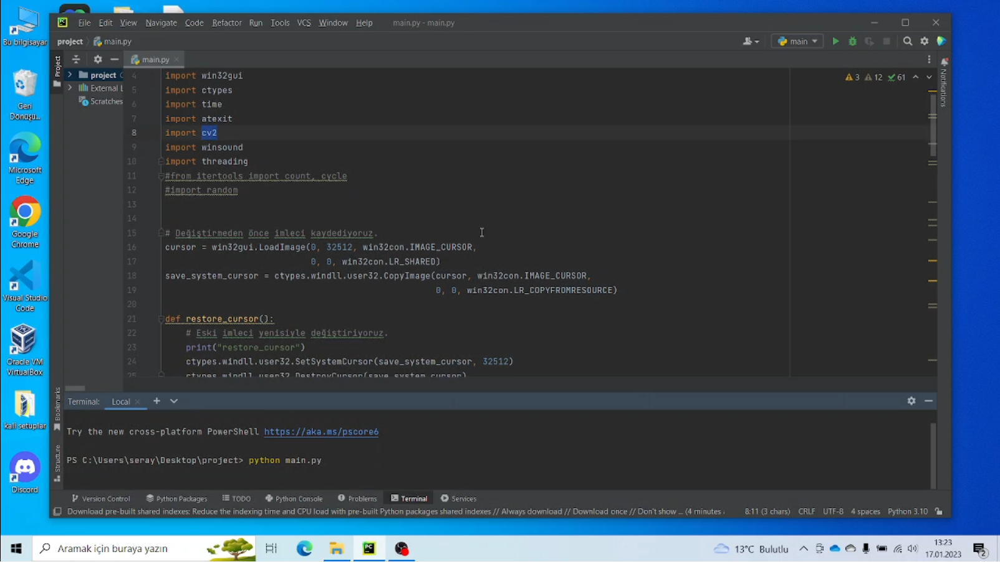
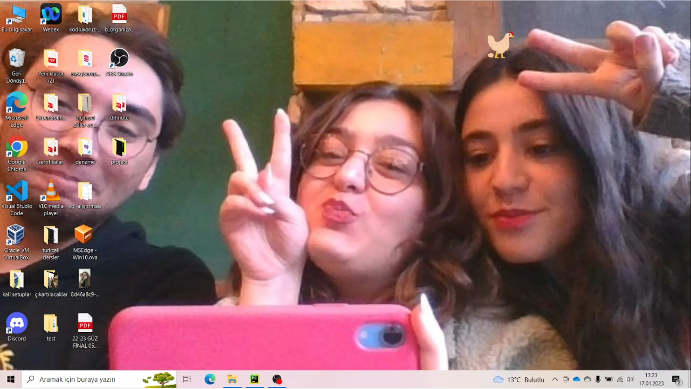

# SÜTLÜ KÖPÜKLÜ
## Kullanıcıyla dalga geçen ve bilgisayarın işleyişini bozan Python projesi

* Sistem imlecinin tavuk ikonuyla değiştirilmesi
* Mouse hızının yavaşlatılması
* 3 saniyede bir tavuk sesi çalınması
* 60 saniye sonra bilgisayarın kapatılması
* 5 saniyede bir kameradan görüntü alınması
* Masaüstü arkaplanının bu görüntüyle değiştirilmesi

## Projenin çalıştırılması
Projeyi çalıştırmak için komut satırında
```
python main.py
```
komutunu kullandık. 

> 

#### Proje çalıştırıldığında o anki görüntüsü

>  


#### YouTube Video Linki
* [Link](https://www.youtube.com/watch?v=R_4VaN85TBM)
